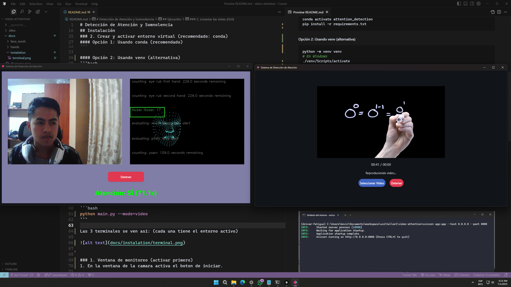
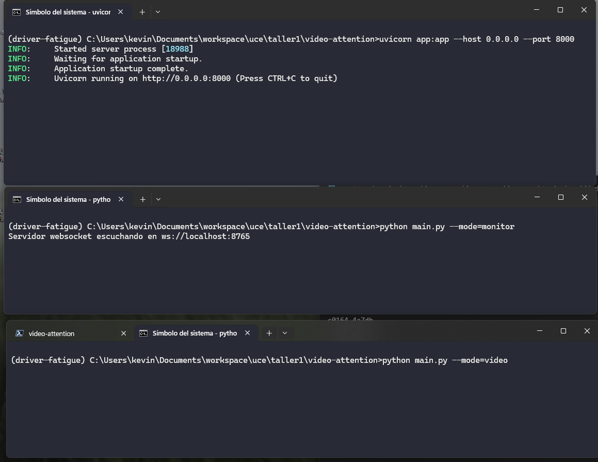
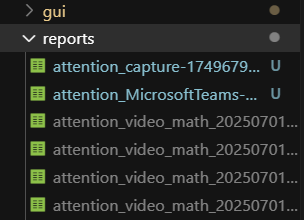

# Detección de Atención y Somnolencia

Este repositorio contiene el código para un sistema de detección de atención y somnolencia en tiempo real usando Python, Mediapipe y Flet.

## Características
- **Procesamiento en tiempo real:** Detección de puntos clave faciales y de manos.
- **Interfaz gráfica moderna:** Visualización de cámara, mesh y estado de atención.
- **Backend robusto:** API con FastAPI para procesamiento y comunicación.

## Requisitos
- **Sistema operativo:** Windows, Linux o macOS
- **Python:** 3.10 o superior (3.12.1 recomendado)
- **CUDA:** 11.7 (opcional, solo si usas GPU)
- **Dependencias:** NumPy, OpenCV, Flet, websockets, etc. (ver `requirements.txt`)




## Instalación

### 1. Clonar el repositorio
```bash
# Clona este repositorio en tu máquina local
 git clone <url>
 cd video-attention
```

### 2. Crear y activar entorno virtual (recomendado: conda)

#### Opción 1: Usando conda (recomendado)
```bash
conda create -n video-attention python=3.12.1
conda activate video-attention
pip install -r requirements.txt
```

#### Opción 2: Usando venv (alternativa)
```bash
python -m venv venv
# En Windows
./venv/Scripts/activate
# En Linux/Mac
source venv/bin/activate
pip install -r requirements.txt
```

## Ejecución

### 1. Levantar el backend (API)
```bash
uvicorn app:app --host 0.0.0.0 --port 8000
```

### 2. Levantar las vistas (GUI)
En **dos terminales diferentes** puedes lanzar:

- **Monitor (detección en vivo con cámara):**
```bash
python main.py --mode=monitor
```

- **Video (detección sincronizada con video):**
```bash
python main.py --mode=video
```

Las 3 terminales se ven asi: (cada una tiene el entorno activo)




### 1. Ventana de monitoreo (activar primero)
1. En la ventana de la camara activa el boton de iniciar.

### 2. Ventana de video
1. Selecciona el video que deseas analizar.
2. Activa el boton de iniciar.
3. Al detener o finalizar el video, se guardara un archivo de log (CSV) en la carpeta /reports.




- ejemplo de log:

donde timestamp_s es el tiempo en segundos y in_attention es 1 si esta en atencion y 0 si no esta en atencion.
```
timestamp,in_attention
timestamp_s,in_attention
0.01,1
1.01,1
2.01,1
3.01,0
4.01,0
5.01,1
```

Puedes abrir cada vista en una pantalla/monitor diferente para una experiencia completa.

## Ejecución en Docker con MinIO (S3)

### 1. Levantar todo con Docker Compose

```bash
docker-compose up --build
```
Esto levantará el backend (FastAPI) y MinIO (S3). El backend guardará los logs de atención y reportes en MinIO automáticamente.

### 2. Ejecutar la GUI en tu máquina host

En otra terminal, activa tu entorno y ejecuta la GUI como antes:

```bash
python main.py --mode=monitor
# o
python main.py --mode=video
```

Asegúrate de que la variable de entorno `BACKEND_URL` apunte al backend (por defecto: http://localhost:8000).

### 3. ¿Dónde se guardan los logs?

- Los logs de atención y reportes se guardan en MinIO, en el bucket `reports`.
- Puedes acceder a ellos usando la interfaz web de MinIO (por defecto en http://localhost:9001, usuario y contraseña: minioadmin).
- También puedes usar cualquier cliente S3 compatible para descargar los archivos.

